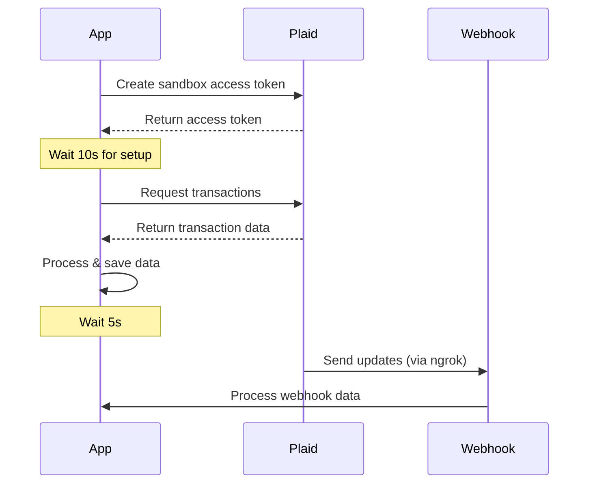

# Plaid Transaction Integration

A Python integration with Plaid's transaction API, including webhook support for real-time updates and sandbox testing.

## Flow Diagram



## Prerequisites

- Python 3.9+
- Plaid account with API credentials
- ngrok (for webhook testing)

## Installation

1. Install Python dependencies:
```bash
pip install -r requirements.txt
```

2. Install ngrok from [ngrok.com](https://ngrok.com/download)

## Environment Configuration

Create a `.env` file:

```env
# Plaid API Credentials
PLAID_CLIENT_ID=your_client_id
PLAID_SECRET=your_secret

# Environment Settings
PLAID_ENV=https://sandbox.plaid.com
PLAID_WEBHOOK_URL=your_webhook_url  # Will be your ngrok URL + /webhook
PLAID_WEBHOOK_PORT=8000

# Test Mode Settings
PLAID_TEST_MODE=true
PLAID_TEST_ITERATIONS=3
```

## Webhook Setup with ngrok

1. Start ngrok:
```bash
ngrok http 8000
```

2. Update `.env` with the ngrok URL:
```env
PLAID_WEBHOOK_URL=https://your-ngrok-url/webhook
```

## Running the Application

1. Standard Test Mode:
```bash
python plaid_integration.py
```

2. Custom Test Iterations:
```bash
PLAID_TEST_ITERATIONS=5 python plaid_integration.py
```

3. Continuous Mode:
```bash
PLAID_TEST_MODE=false python plaid_integration.py
```

## Timing Configuration

- Initial wait time: 10 seconds (after access token creation)
- Wait time between iterations: 5 seconds
- Rate limit exceeded wait time: 120 seconds

## Generated Files

- `transactions_test_[N]_[timestamp].csv`: Transaction data
- `insights_test_[N]_[timestamp].csv`: Analysis insights
- `plaid_webhook.log`: Webhook event logs
- `plaid_debug.log`: Debug logs
- `.access_token`: Stored access token

## Sandbox Testing Credentials

- Institution: Chase (ins_109508)
- Username: `user_good`
- Password: `pass_good`
- MFA code: Any code works (e.g., '1234')
